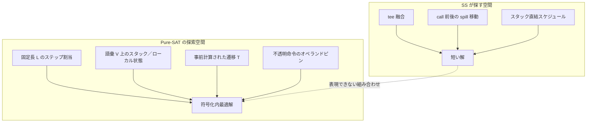
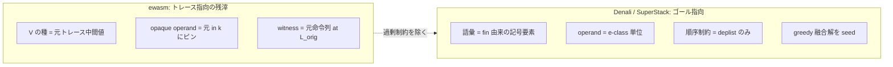

# tee 融合スケジュールに到達できない理由（手法分析）

対象: **`local.tee` は命令集合に含まれるが、SuperStack（以下 SS）が見つける tee 融合スケジュールに Pure-SAT が到達できない**ケース。  
参照仕様: [`SAT.md`](SAT.md)  
関連: [`0701_ewasm_bug.md`](0701_ewasm_bug.md)（具体例）、[`0701_bugfix_soundness.md`](0701_bugfix_soundness.md)（ベンチ結果）

本ノートは**ソースコードではなく手法・符号化の設計上の限界**を述べる。`tee[-1]`（合成 scratch local 不足）の問題は別論点であり、ここでは扱わない。

---

## 1. 何が起きているか

SS の短縮は、単なる `local.set` + `local.get` → `local.tee` の置換ではない。典型例では次が**同時**に必要になる。

| 変形 | 内容 |
|------|------|
| **局所 tee 融合** | 同一スロットへの set 直後の get を tee にまとめ、1 命令削減 |
| **spill スケジュール変更** | call の前にローカルへ逃がしていた値を、call を挟んでスタック上に保持し、call 後に tee で確定 |
| **命令並べ替え** | 上記を成立させるため、純粋演算・ローカル操作・副作用命令の相対順序を変える |

Pure-SAT は降順反復で「現符号化の中ではこれ以上短くない」と証明し `optimal` を付けるが、その「現符号化」が SS 解のスケジュールを表現できていない。これは**健全性バグ（誤った長い解の受理）ではなく、探索空間の不完全性**である。

---

## 2. SS 解と Pure-SAT 探索空間のギャップ（概念図）

---

## 3. 手法上の限界と SAT.md の対応箇所

### 3.1 語彙 $V$ がオリジナルトレース中心（§2.1, §2.2, §7.3）

**問題:** スタック各位置の値は有限集合 $V$ の要素でしか表現できない。$V$ は主に $\mathit{init}$、$\mathit{fin}$、オリジナル命令列の記号実行で現れる中間値から構築される（§2.1 ステップ 4）。

tee 融合でスケジュールが変わると、**オリジナルには現れなかった中間スタック構成**が必要になる。たとえば call 手前でローカルに逃がさずスタックに載せたままにすると、call 実行時点の天端付近の値の「ラベル」（$V$ 内のどの代表元か）がオリジナルトレースとは異なる。

**限界:** §2.1 ステップ 5 の $\equiv_R$ 展開は、**既に $V$ に入った値の別表現**を増やすもので、新しいスケジュール固有の中間構成を自動的には生まない。§7.3 の「$V$ が不完全」に該当するが、単に $k_{\mathrm{sat}}$ を増やすだけでは tee 融合スケジュール用の新しい中間状態は補われない。

---

### 3.2 演算遷移テーブル $T$ の事前固定（§2.3, §5.3）

**問題:** 二項演算 $\oplus$ は、$(v_1, v_0) \in V \times V$ について事前計算された $T_\oplus(v_1, v_0)$ がある場合にのみ遷移可能（§5.3）。未定義のペアは CNF 上禁止される。

スケジュール変更により、ある演算の直前スタックが $(v_1, v_0)$ ではなく、別の組合せ（オペランド順が入れ替わった同値ペアなど）になることがある。$T$ がそのペアを事前に含まないと、**意味的には正しいがテーブル上は到達不能**な経路になる。

**限界:** §7.4 の「算術の選択は $T$ で吸収」とあるが、これは $V$ と $T$ に既に載っている組合せに限る。tee によるデータフロー変更で新しいペアが必要になった場合、$T$ は探索空間を狭める。

---

### 3.3 不透明命令のオペランド・スタック形状の固定（§11.1–§11.3）

**問題:** 各不透明命令（load / store / call 等）は、パース時点の記号実行から得た固定の入力列 $\mathit{in}[0..p)$ と出力列 $\mathit{out}[0..q)$ を持つ（§11.1）。§11.3 は「ステップ $i$ でその命令を実行するなら、直前スタックの天端 $p$ セルが $\mathit{in}[k]$ と一致する」ことを要求する。

tee 融合で純粋演算の順序やスタック経路が変わると、同じ load / call に渡る式は $\equiv_R$ では同値でも、**記録された $\mathit{in}[k]$ というシンボル列とは構造が異なる**ことがある（典型: 可換 `add` のオペランド順の差）。

**限界:** 符号化は「元トレースで観測されたシンボル」にスタックを合わせる設計であり、「同値な別経路から構築された式」まで自由に受け入れる設計ではない。§11.3 のオペランド要求が、スケジュール変更後の正当な tee 解を探索空間外に押し出す。

---

### 3.4 call を挟んだ spill タイミング（§11.3, §11.5, §7.4）

**問題:** SS の典型短縮は「call 前の `set` + call 後の `get`」をやめ、call 中もスタックに値を残し、call 後の `tee` でローカル確定する。

Pure-SAT では:
- 不透明 call は固定の $(p, q)$ 入出力でスタックをシフトする（§11.3）
- メモリ・変数・部分式依存は $\mathit{deplist}$ で順序固定（§11.5）
- $\mathrm{tee}_x$ はスタックを不変に保つ（§5.3）

これらは個別には正しいが、組み合わせると **「call 手前の天端に載せたい値の系列」** が、オリジナル（call 前に set で退避）とは異なるスタック高さ・値ラベルの系列を要求する。§7.4 が「スピル判断は SAT が自由に行う」と述べるが、実際には **call のスタックシグネチャと $\mathit{fin}$ が許す系列**に限定され、オリジナルが経由しなかった系列は §3.1 の語彙不足と相まって表現されない。

---

### 3.5 境界制約 $\mathit{init}$ / $\mathit{fin}$（§5.2）

**問題:** 最終ローカル $M_*$ は、変更が記録されたスロットのみ拘束され、それ以外は入口値と一致することが要求される（§5.2, §11 実装慣行）。

tee 融合でローカルへの書き込みタイミングが変わっても、**最終的なローカル内容は元プログラムと同じ**でなければならない。call 後 tee に移したスケジュールは、この等式を満たしうるが、途中のスタック系列が §3.1–§3.4 の制約と両立しないと CNF 上は実現不能になる。

---

### 3.6 「符号化内最適」と「真の最適」の混同（§6, §7.2, §7.3）

**問題:** 降順 Pure-SAT は、長さ $L^*-1$ で UNSAT・長さ $L^*$ で SAT になった時点で、**語彙 $V$・上界 $L,H,R$・現行制約の下での最短**であると結論づける（§7.2）。

tee 融合解が探索空間外なら、$L^* = L_{\mathrm{orig}}$ のまま「証明完了」となりうる。§7.3 は $V,H,R,\equiv_R$ の不足を列挙するが、**スケジュール表現力の不足**（オリジナルトレース以外のデータフロー）までは明示していない。

---

### 3.7 符号化後の再検証レイヤ（§11.6）

**問題:** §11.6 は、SAT モデルに対し前方実行と依存・storage 保存を再確認すると記す。実装ではさらに、各不透明命令の入力が元セグメントの記録と $\equiv_R$ で一致するかを検証する層がある。

符号化（§11.3）はスタック位置を特定の $V$ 要素に固定する一方、再検証は**実行トレース上の式同値**を要求する。この二層の前提がずれると、理論上は短いスケジュールがあっても SAT 解として採用されない、あるいはそもそも CNF が UNSAT になる。

§11.6 は「制約が正しければ再検証は常に成立する」とあるが、**再検証が符号化より厳しい（または異なる軸で厳しい）**場合、この前提は成り立たない。

---

## 4. 限界の整理表

「対策」列は §5.2 の方向 A–F に対応する。

| 現象 | SS がやること | SAT.md の弱点 | 本質 | 対策（§5.2） |
|------|--------------|---------------|------|--------------|
| tee 融合 1 命令削減 | set+get → tee | §3 に tee はあるが §2 の $V$ が足りない場合あり | 中間スタック状態の表現不足 | C, E |
| call 前後 spill 移動 | set/get 削除、スタック直結 | §11.3 + §3.1 + §7.4 の過大評価 | call 境界のスタック系列が語彙外 | C, D |
| 演算オペランド順の差 | 可換演算の並べ替え | §11.3 のオペランドピン | 同値だが別表現の入力を拒否 | **A, B**（主因対策） |
| optimal 表示 | — | §7.2–§7.3 | 符号化内最適 ≠ グローバル最適 | F |

---

## 5. 解決の方向（手法レベル・論文根拠で再検討）

### 5.1 根本原因の再定義: トレース指向 → ゴール指向

3 つの先行研究（Denali / SuperStack / Ruler）と照合すると、ewasm の限界は個別の制約バグではなく、**符号化の立脚点そのもの**にあると再定義できる。

ewasm は Denali 流の **E-graph 値正規化**と SuperStack 流の**スタックセル SAT** のハイブリッドだが、そこに**トレース指向の残滓**が残る — 語彙 $V$ の種・不透明命令オペランドの $\mathit{in}[k]$ ピン・$L_{\mathrm{orig}}$ witness が、いずれも**元命令列に紐づく**。

対して Denali と SuperStack は純粋に**ゴール指向**である。

- **SuperStack**（§4.1）: SAT の命令集合は `op(term) | term ∈ fin.Terms`、すなわち**最終状態（ゴール）由来**。元命令列は `fin` の算出・`deplist`・greedy 上界にしか使わず、**スケジュールは完全に自由**（順序制約は `deplist` のみ）。tee 融合・spill 移動はこの自由から自然に出現する。
- **Denali**（§5–§6）: E-graph が「ゴール項を計算する**全ての方法**」を表現し、SAT は e-class 単位（`B(i,Q)` = クラス $Q$ が計算済み、`args(T)` = オペランドの同値類）で最短スケジュールを選ぶ。元トレース再現の制約は一切ない。

tee 融合ギャップは、この**トレース指向の残滓が過剰制約になる箇所**である。

### 5.2 方向（優先度は影響度 × 独立性）

| 優先度 | 手法変更 | 狙い | 対応 § | 根拠論文 |
|--------|---------|------|--------|----------|
| **A** | `≡_R` ルールセットを **Ruler で網羅化** | 可換 add のオペランド順差など「同値だが別表現」を canon 上で真に統合。観測された commutative-add ブロッカーの直接原因を潰す | §3.2, §3.3, §7.3 | **Ruler** |
| **B** | 遷移表 $T$ と不透明命令オペランドを「代表元」でなく **e-class 全体で閉じる** | binop の全オペランド順エッジ、opaque の同値類許容。A が供給した同値を探索空間に反映 | §3.2, §3.3, §11.3 | **Denali**（`args(T)` = e-class, `B(i,Q)`） |
| **C** | 語彙を**トレース閉包からゴール指向へ** | `fin` の記号要素を起点に `≡_R` 閉包。中間スタック状態の表現不足を解消。現「CEGAR 語彙」を包摂する本命 | §3.1, §7.3 | **Denali** §5, **SuperStack** §2.4 |
| **D** | スケジュールをトレースから分離し**依存順序のみ残す** | Denali の select-store **節**で load/store 順序自由を与え、`deplist` の過剰な全順序を緩める | §3.3, §3.4 | **Denali** §6–7, **SuperStack** §4 |
| **E** | **greedy 融合 seed** の導入 | SuperStack の Wasm greedy で tee 融合済み `seqGrd` を作り、上界短縮＋良い初期モデルとして SAT に渡す。A–D で符号化が表現可能になれば効果大 | §3.6, §6 | **SuperStack** §3.2 |
| **F** | `optimal` を**「符号化・ルールセット相対の最適」に分離** | Denali の "near-optimal" 開示に倣い誤解を防ぐ | §7.2 | **Denali** §6 |

### 5.3 依存関係と実装順

- **A → B** が最優先の連鎖。A（`≡_R` の網羅化）が「同値の前提」を供給し、B（e-class 閉包）がそれを CNF の遷移・オペランド制約に反映して初めて、SS の tee 融合スケジュールが探索空間に入る。現状の「オペランド同値類緩和」は B の部分実装であり、A なしでは `≡_R` の穴（可換律など）でそのまま漏れる。
- **C・D** は原理的な深い修正。トレース依存を語彙・スケジュールの両面で外し、Denali/SuperStack のゴール指向に寄せる。A/B を前提にすると自然に接続する。
- **E** は実務的ブースター。A–D で符号化が SS 解を表現できるようになれば、greedy 融合 seed が上界を締めて SAT を「最適性証明」に専念させられる。
- **F** は正直さ。Denali すら "near-optimal" と明記しており、`optimal` ラベルは符号化・ルールセット相対であることを表示上分離すべき。

---

## 6. まとめ

`local.tee` が命令集合に含まれることと、**SS 型の tee 融合スケジュールが Pure-SAT で見つかることは別問題**である。

根本は、Pure-SAT が「固定長・有限語彙・事前計算遷移・元トレース由来の不透明オペランド」という**トレース指向（オリジナル中心）の閉世界**で最適化しているのに対し、Denali/SuperStack は**ゴール指向**（語彙・命令集合を `fin` から作り、スケジュールを自由化）で、tee 融合はまさにその自由から出るスケジュール最適化だからである（§5.1）。

したがって解決は個別制約の緩和ではなく、**トレース指向の残滓を外してゴール指向へ寄せる**方向にある。直近の主因（可換オペランド順）は **A（Ruler による `≡_R` 網羅化）→ B（e-class 閉包）** の連鎖で、原理的には **C（ゴール指向語彙）・D（依存順序のみのスケジュール）** で解消する（§5.2, §5.3）。

[`SAT.md`](SAT.md) §7.4 はこの点で過大に「同時最適化が保たれる」と述べており、§7.3・§11 付近の追記が必要である（§7.5, §11.8 参照）。
